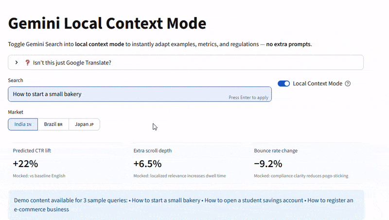

# Gemini Local Context Mode — Prototype

Toggle Gemini Search into **local context mode** to adapt examples, currency, and compliance inline for each market — **no extra prompts**.

### Run locally
```bash
pip install -r requirements.txt
streamlit run app.py

## ❓ Isn't this just Google Translate?

No.

A **language translator** converts the *same* meaning from Language A → Language B.
- Example: “How to start a bakery” → “Cómo abrir una panadería” (same facts, different language).
- Goal: **Fidelity to original text**.

**Gemini Local Context Mode** rewrites the answer so it’s *trusted, actionable, and relevant* **in a specific market**.
- It **changes the facts**, not just the words:
  - India → FSSAI license, INR costs, Swiggy/Zomato.
  - Brazil → CNPJ, BRL costs, ANVISA rules.
  - Japan → 保健所許可, yen costs, LINE marketing.
- Goal: **Fidelity to intent + full localization** (regulations, currency, examples, tone).

💡 One-liner: *Translate changes the words. Local Context Mode changes the world around those words so it feels like it was written for you.*




**Week 2 (A/B Day 6)** — CTR: **21.4%** vs 20.0% control (**+7.0% rel, p=0.021**) • Bounce: **11.9%** vs 12.5% (**−4.8% rel**) • Scroll: **56.1%** vs 54.0% (**+3.9% rel**) • Toggle usage: **68%** of LCI sessions • Latency add: **P50 +38 ms / P95 +112 ms** (PASS) • Staleness: **0.8%** (PASS) • Error flags: **0.2%/h** (PASS) • N≈**85k** sessions/arm (IN 35k, BR 28k, JP 22k)


